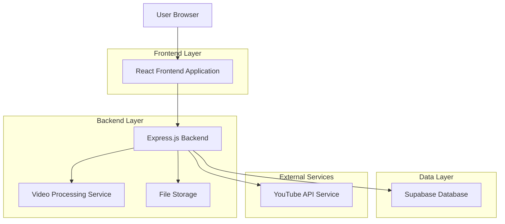
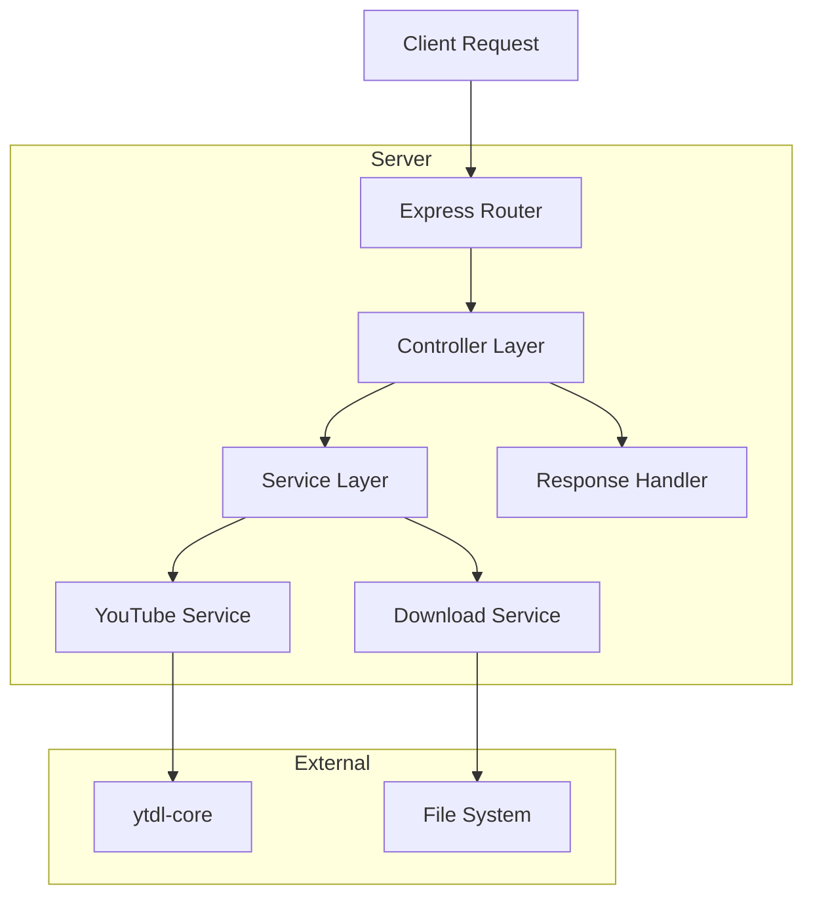
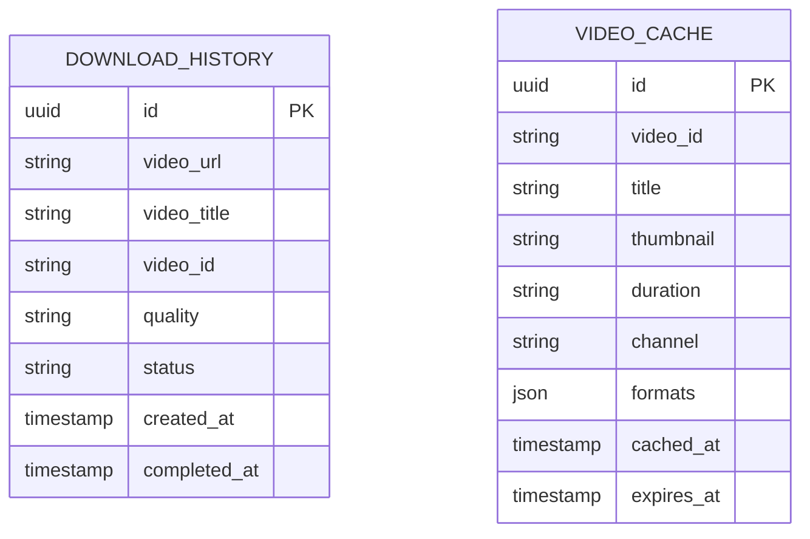

# YTDownloadXPRO 技術架構文檔

## 1. Architecture design



## 2. Technology Description

* Frontend: React\@18 + TypeScript + Tailwind CSS\@3 + Vite

* Backend: Express.js\@4 + TypeScript + ytdl-core

* Database: Supabase (PostgreSQL)

* File Storage: Local storage / Cloud storage (optional)

* Video Processing: ytdl-core, ffmpeg (for format conversion)

## 3. Route definitions

| Route               | Purpose               |
| ------------------- | --------------------- |
| /                   | 首頁，包含YouTube網址輸入和檢查功能 |
| /download/:videoId  | 下載頁面，顯示影片資訊和畫質選項      |
| /about              | 關於頁面，產品介紹和使用說明        |
| /api/video/info     | API路由，獲取YouTube影片資訊   |
| /api/video/download | API路由，處理影片下載請求        |

## 4. API definitions

### 4.1 Core API

**獲取影片資訊**

```
POST /api/video/info
```

Request:

| Param Name | Param Type | isRequired | Description |
| ---------- | ---------- | ---------- | ----------- |
| url        | string     | true       | YouTube影片網址 |

Response:

| Param Name     | Param Type | Description |
| -------------- | ---------- | ----------- |
| success        | boolean    | 請求是否成功      |
| data           | object     | 影片資訊物件      |
| data.title     | string     | 影片標題        |
| data.thumbnail | string     | 影片縮圖網址      |
| data.duration  | string     | 影片時長        |
| data.channel   | string     | 頻道名稱        |
| data.formats   | array      | 可用格式列表      |

Example:

```json
{
  "url": "https://www.youtube.com/watch?v=dQw4w9WgXcQ"
}
```

**下載影片**

```
POST /api/video/download
```

Request:

| Param Name | Param Type | isRequired | Description                |
| ---------- | ---------- | ---------- | -------------------------- |
| url        | string     | true       | YouTube影片網址                |
| quality    | string     | true       | 選擇的畫質 (1080p, 720p, 480p等) |
| format     | string     | false      | 輸出格式，預設為mp4                |

Response:

| Param Name  | Param Type | Description |
| ----------- | ---------- | ----------- |
| success     | boolean    | 下載是否成功      |
| downloadUrl | string     | 下載連結        |
| filename    | string     | 檔案名稱        |

## 5. Server architecture diagram



## 6. Data model

### 6.1 Data model definition



### 6.2 Data Definition Language

**下載歷史表 (download\_history)**

```sql
-- create table
CREATE TABLE download_history (
    id UUID PRIMARY KEY DEFAULT gen_random_uuid(),
    video_url VARCHAR(500) NOT NULL,
    video_title VARCHAR(200),
    video_id VARCHAR(50) NOT NULL,
    quality VARCHAR(20) NOT NULL,
    status VARCHAR(20) DEFAULT 'pending' CHECK (status IN ('pending', 'processing', 'completed', 'failed')),
    created_at TIMESTAMP WITH TIME ZONE DEFAULT NOW(),
    completed_at TIMESTAMP WITH TIME ZONE
);

-- create index
CREATE INDEX idx_download_history_video_id ON download_history(video_id);
CREATE INDEX idx_download_history_created_at ON download_history(created_at DESC);
CREATE INDEX idx_download_history_status ON download_history(status);

-- grant permissions
GRANT SELECT ON download_history TO anon;
GRANT ALL PRIVILEGES ON download_history TO authenticated;
```

**影片快取表 (video\_cache)**

```sql
-- create table
CREATE TABLE video_cache (
    id UUID PRIMARY KEY DEFAULT gen_random_uuid(),
    video_id VARCHAR(50) UNIQUE NOT NULL,
    title VARCHAR(200) NOT NULL,
    thumbnail VARCHAR(500),
    duration VARCHAR(20),
    channel VARCHAR(100),
    formats JSONB,
    cached_at TIMESTAMP WITH TIME ZONE DEFAULT NOW(),
    expires_at TIMESTAMP WITH TIME ZONE DEFAULT (NOW() + INTERVAL '24 hours')
);

-- create index
CREATE INDEX idx_video_cache_video_id ON video_cache(video_id);
CREATE INDEX idx_video_cache_expires_at ON video_cache(expires_at);

-- grant permissions
GRANT SELECT ON video_cache TO anon;
GRANT ALL PRIVILEGES ON video_cache TO authenticated;
```

