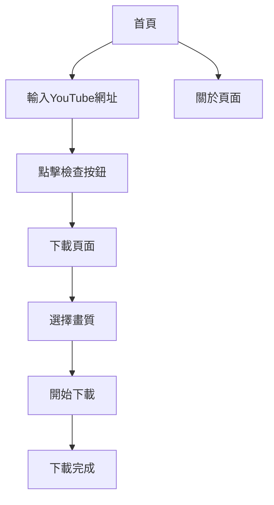

# YTDownloadXPRO 產品需求文檔

## 1. Product Overview
YTDownloadXPRO 是一個專業的YouTube影片下載網站，提供將YouTube影片轉換為MP4格式的服務。網站採用極致精美的設計風格，操作流暢直觀，讓用戶能夠輕鬆下載高品質的YouTube影片。
- 解決用戶需要離線觀看YouTube影片的需求，提供多種畫質選項以滿足不同使用場景
- 目標市場為需要下載YouTube影片進行離線觀看、內容創作或教育用途的用戶群體

## 2. Core Features

### 2.1 User Roles
由於產品功能相對簡單，暫不區分用戶角色，所有訪客均可直接使用下載功能。

### 2.2 Feature Module
我們的YTDownloadXPRO需求包含以下主要頁面：
1. **首頁**：品牌展示區、YouTube網址輸入框、檢查按鈕、功能說明
2. **下載頁面**：影片資訊展示、畫質選項列表、下載按鈕、進度顯示
3. **關於頁面**：產品介紹、使用說明、常見問題

### 2.3 Page Details

| Page Name | Module Name | Feature description |
|-----------|-------------|---------------------|
| 首頁 | 品牌展示區 | 顯示YTDownloadXPRO品牌標誌、標語和核心價值主張 |
| 首頁 | 網址輸入模組 | 提供中央輸入框供用戶貼上YouTube影片網址，包含輸入驗證和格式檢查 |
| 首頁 | 檢查按鈕 | 觸發影片資訊獲取和畫質檢測功能，顯示載入狀態 |
| 首頁 | 功能說明區 | 簡潔說明使用步驟和支援的影片格式 |
| 下載頁面 | 影片資訊展示 | 顯示影片縮圖、標題、時長、頻道名稱等基本資訊 |
| 下載頁面 | 畫質選項列表 | 自動檢測並列出所有可用畫質選項（1080p、720p、480p等），標示最高畫質 |
| 下載頁面 | 下載功能 | 提供下載按鈕，顯示下載進度和完成狀態 |
| 關於頁面 | 產品介紹 | 詳細介紹產品功能、特色和使用場景 |
| 關於頁面 | 使用指南 | 提供詳細的操作步驟和注意事項 |
| 關於頁面 | 常見問題 | 回答用戶常見疑問和技術支援資訊 |

## 3. Core Process

**主要用戶操作流程：**
1. 用戶訪問YTDownloadXPRO首頁
2. 在中央輸入框貼上YouTube影片網址
3. 點擊「檢查」按鈕，系統驗證網址並獲取影片資訊
4. 系統自動跳轉至下載頁面，顯示影片詳情和可用畫質選項
5. 用戶選擇所需畫質，點擊下載按鈕
6. 系統開始處理並提供下載連結
7. 用戶完成影片下載

## 4. User Interface Design

### 4.1 Design Style
- **主色調**：深藍色 (#1a365d) 和鮮紅色 (#e53e3e)，體現專業性和YouTube品牌關聯
- **輔助色**：淺灰色 (#f7fafc) 背景，深灰色 (#2d3748) 文字
- **按鈕風格**：圓角設計 (border-radius: 8px)，具有懸停效果和陰影
- **字體**：主標題使用 24-32px 粗體，正文使用 16px 中等字重，代碼字體使用等寬字體
- **佈局風格**：卡片式設計，頂部導航，響應式網格佈局
- **圖標風格**：使用簡潔的線性圖標，支援下載、播放、設定等功能圖標

### 4.2 Page Design Overview

| Page Name | Module Name | UI Elements |
|-----------|-------------|-------------|
| 首頁 | 品牌展示區 | 大型標誌居中顯示，漸層背景，動態標語文字效果 |
| 首頁 | 網址輸入模組 | 大型圓角輸入框 (width: 600px)，佔位符文字，即時驗證提示 |
| 首頁 | 檢查按鈕 | 鮮紅色主按鈕，白色文字，載入動畫效果 |
| 下載頁面 | 影片資訊展示 | 卡片式佈局，左側縮圖，右側文字資訊，陰影效果 |
| 下載頁面 | 畫質選項列表 | 垂直排列的選項卡，每個選項顯示解析度和檔案大小 |
| 下載頁面 | 下載功能 | 進度條動畫，成功/錯誤狀態提示，下載連結按鈕 |
| 關於頁面 | 內容區域 | 簡潔的文字排版，適當的行距和段落間距，重點內容高亮 |

### 4.3 Responsiveness
網站採用移動優先的響應式設計，確保在桌面、平板和手機上都能提供優質的用戶體驗。針對觸控設備優化按鈕大小和間距，確保易於操作。